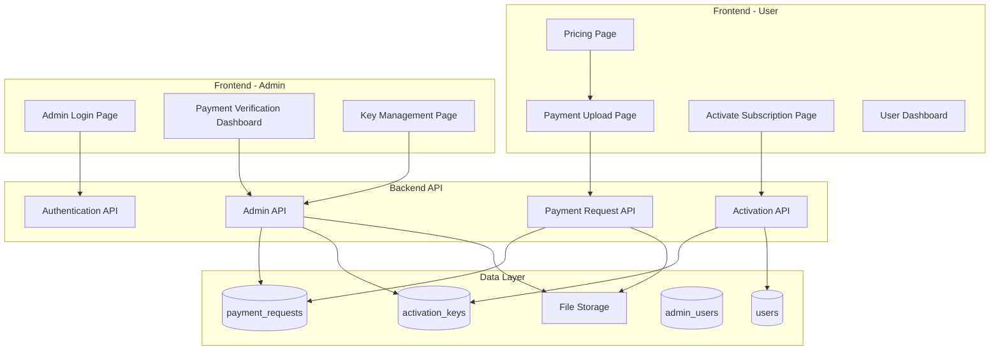
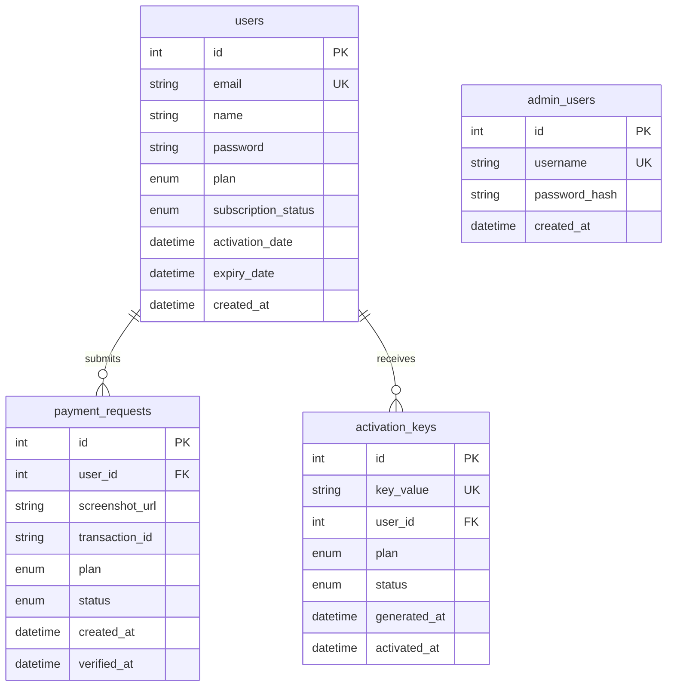
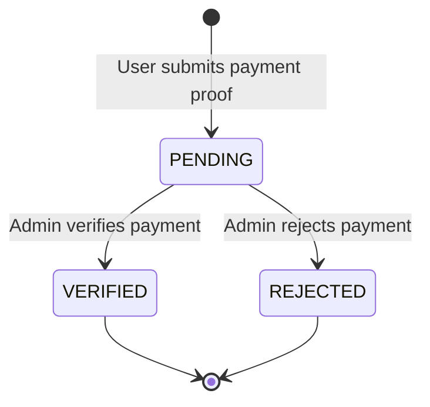
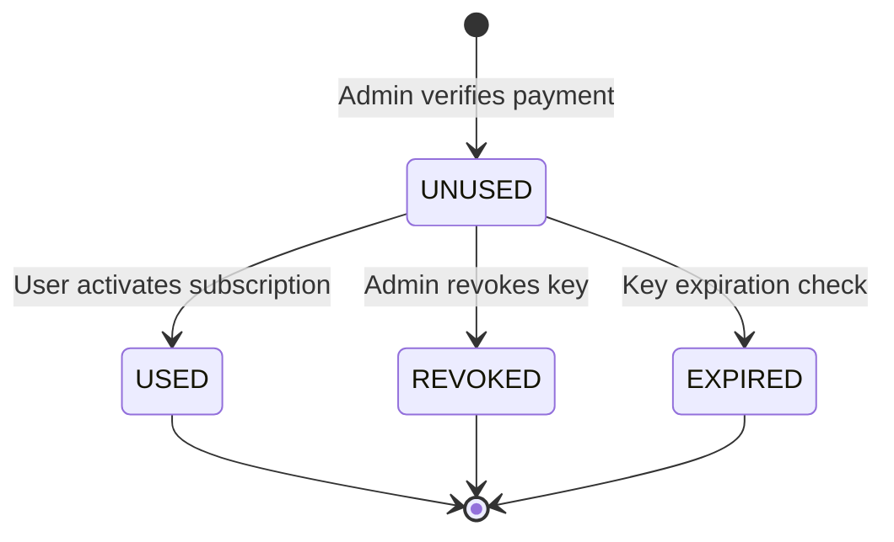

# Design Document: Activation Key-Based Subscription System

## Overview

This design document describes the architecture and implementation approach for replacing the Razorpay payment integration with a manual activation key-based subscription system. The system enables users to submit payment proof, allows admins to verify payments and generate unique activation keys, and enables users to activate their subscriptions with these keys.

### Key Design Decisions

1. **Manual Payment Verification**: Shifts from automated Razorpay webhooks to manual admin verification, providing more control over payment validation
2. **Cryptographic Key Generation**: Uses Node.js crypto.randomBytes() for secure, unpredictable activation key generation
3. **File Upload Strategy**: Implements Multer for secure multipart form-data handling with file size and type validation
4. **State Machine Pattern**: Treats activation keys and payment requests as state machines with well-defined transitions
5. **Separation of Concerns**: Maintains clear boundaries between user flows, admin flows, and system logic

## Architecture

### System Components

The system is organized into the following major components:




### Technology Stack

**Frontend:**
- React 18 (existing)
- Client-side routing with hash-based navigation (existing pattern)
- Fetch API for HTTP requests
- CSS modules (existing pattern)

**Backend:**
- Node.js with Express (existing)
- MySQL 2 database driver (existing)
- Multer for file uploads (new dependency)
- JWT for authentication (existing)
- crypto module for key generation (Node.js built-in)

**Database:**
- MySQL (existing)
- New tables: payment_requests, activation_keys, admin_users

**Infrastructure:**
- Frontend: Netlify (existing)
- Backend: Render (existing)
- File Storage: Local filesystem on Render with persistent storage

## Components and Interfaces

### Backend API Endpoints

#### Payment Request Endpoints

**POST /api/payment-requests/submit**

- **Purpose**: User submits payment proof with screenshot and transaction ID
- **Authentication**: Required (JWT token)
- **Request**: Multipart form-data
  ```javascript
  {
    screenshot: File, // image file (PNG, JPG, JPEG)
    transactionId: string,
    plan: "PRO" | "BUSINESS"
  }
  ```
- **Response**: 
  ```javascript
  {
    success: true,
    message: "Payment proof submitted successfully",
    requestId: number
  }
  ```
- **Validation**:
  - File type: PNG, JPG, JPEG only
  - File size: Maximum 5MB
  - Transaction ID: Non-empty string
  - Plan: Must be "PRO" or "BUSINESS"

**GET /api/payment-requests/my-requests**
- **Purpose**: User retrieves their own payment requests
- **Authentication**: Required (JWT token)
- **Response**:
  ```javascript
  {
    requests: [
      {
        id: number,
        plan: string,
        transactionId: string,
        status: "PENDING" | "VERIFIED" | "REJECTED",
        createdAt: string,
        verifiedAt: string | null
      }
    ]
  }
  ```

#### Activation Endpoints

**POST /api/activation/activate**
- **Purpose**: User activates subscription with an activation key
- **Authentication**: Required (JWT token)
- **Request**:
  ```javascript
  {
    activationKey: string // Format: BBSG-XXXX-XXXX-XXXX
  }
  ```
- **Response**:
  ```javascript
  {
    success: true,
    message: "Subscription activated successfully",
    subscription: {
      plan: "PRO" | "BUSINESS",
      activatedAt: string,
      expiryDate: string
    }
  }
  ```
- **Error Responses**:
  - 400: Invalid key format
  - 404: Key does not exist
  - 403: Key not valid for this user / Key already used / Key revoked / Key expired

#### Admin Endpoints

**POST /api/admin/login**
- **Purpose**: Admin authentication
- **Authentication**: None (this creates the token)
- **Request**:
  ```javascript
  {
    username: string,
    password: string
  }
  ```
- **Response**:
  ```javascript
  {
    token: string,
    admin: {
      id: number,
      username: string
    }
  }
  ```

**GET /api/admin/payment-requests**
- **Purpose**: Retrieve all payment requests (optionally filtered)
- **Authentication**: Required (Admin JWT token)
- **Query Parameters**: `?status=PENDING|VERIFIED|REJECTED`
- **Response**:
  ```javascript
  {
    requests: [
      {
        id: number,
        userId: number,
        userEmail: string,
        userName: string,
        screenshotUrl: string,
        transactionId: string,
        plan: "PRO" | "BUSINESS",
        status: "PENDING" | "VERIFIED" | "REJECTED",
        createdAt: string,
        verifiedAt: string | null
      }
    ]
  }
  ```

**POST /api/admin/verify-payment**
- **Purpose**: Admin verifies payment and generates activation key
- **Authentication**: Required (Admin JWT token)
- **Request**:
  ```javascript
  {
    requestId: number
  }
  ```
- **Response**:
  ```javascript
  {
    success: true,
    activationKey: string,
    message: "Payment verified and activation key generated"
  }
  ```
- **Side Effects**:
  - Creates activation key record
  - Updates payment request status to VERIFIED
  - Records verification timestamp

**POST /api/admin/reject-payment**
- **Purpose**: Admin rejects a payment request
- **Authentication**: Required (Admin JWT token)
- **Request**:
  ```javascript
  {
    requestId: number
  }
  ```
- **Response**:
  ```javascript
  {
    success: true,
    message: "Payment request rejected"
  }
  ```

**GET /api/admin/activation-keys**
- **Purpose**: Retrieve all activation keys (optionally filtered/searched)
- **Authentication**: Required (Admin JWT token)
- **Query Parameters**: 
  - `?status=UNUSED|USED|REVOKED|EXPIRED`
  - `?search=BBSG-XXXX`
- **Response**:
  ```javascript
  {
    keys: [
      {
        id: number,
        keyValue: string,
        userId: number,
        userEmail: string,
        plan: "PRO" | "BUSINESS",
        status: "UNUSED" | "USED" | "REVOKED" | "EXPIRED",
        generatedAt: string,
        activatedAt: string | null
      }
    ]
  }
  ```

**POST /api/admin/revoke-key**
- **Purpose**: Admin revokes an unused activation key
- **Authentication**: Required (Admin JWT token)
- **Request**:
  ```javascript
  {
    keyId: number
  }
  ```
- **Response**:
  ```javascript
  {
    success: true,
    message: "Activation key revoked"
  }
  ```
- **Validation**: Only keys with status UNUSED can be revoked

### Frontend Components

#### User Pages

**PaymentUploadPage**
- Route: `#/payment-upload`
- Purpose: Allow users to submit payment proof
- Features:
  - Plan selection dropdown (PRO/BUSINESS)
  - Admin phone number display
  - File upload input with preview
  - Transaction ID text input
  - Submit button
  - Form validation
- State Management:
  - Selected plan
  - Uploaded file
  - Transaction ID
  - Submission loading state
  - Error/success messages

**ActivateSubscriptionPage**
- Route: `#/activate`
- Purpose: Allow users to enter and submit activation keys
- Features:
  - Activation key input (formatted: BBSG-XXXX-XXXX-XXXX)
  - Auto-formatting as user types
  - Submit button
  - Validation feedback
  - Success redirect to dashboard
- State Management:
  - Activation key value
  - Submission loading state
  - Error/success messages

**Updated Dashboard**
- Route: `#/dashboard` (existing)
- Additional Features:
  - Subscription details card showing:
    - Current plan (FREE/PRO/BUSINESS)
    - Activation date (if active)
    - Expiry date (if active)
    - Days remaining (calculated)
    - Subscription status badge
  - Renewal button (redirects to pricing if expired)
  - Link to activate subscription page

**Updated Pricing Page**
- Route: `#/pricing` (existing)
- Changes:
  - Remove Razorpay payment buttons
  - Add admin contact information display
  - Add "Submit Payment Proof" button linking to payment upload page
  - Display payment instructions (UPI/Bank transfer details)

#### Admin Pages

**AdminLoginPage**
- Route: `#/admin/login`
- Purpose: Admin authentication
- Features:
  - Username input
  - Password input
  - Login button
  - Error message display
- State Management:
  - Username
  - Password
  - Loading state
  - Error messages

**PaymentVerificationDashboard**
- Route: `#/admin/payments`
- Purpose: View and verify payment requests
- Features:
  - Filter tabs (All/Pending/Verified/Rejected)
  - Payment request cards showing:
    - User information
    - Screenshot thumbnail (clickable for full view)
    - Transaction ID
    - Plan selected
    - Submission date
    - Verify/Reject buttons (for pending)
  - Modal for full-size screenshot viewing
  - Success notification on verification
- State Management:
  - Payment requests list
  - Current filter
  - Selected request (for modal)
  - Loading states

**ActivationKeyManagementPage**
- Route: `#/admin/keys`
- Purpose: View, search, and manage activation keys
- Features:
  - Search input (partial key matching)
  - Status filter dropdown
  - Keys table with columns:
    - Key value (with copy button)
    - User email
    - Plan
    - Status badge
    - Generated date
    - Activated date
    - Actions (revoke button for unused)
  - Copy-to-clipboard functionality
  - Confirmation modal for revoke action
- State Management:
  - Keys list
  - Search query
  - Status filter
  - Loading states

## Data Models

### Database Schema

#### users table (updated)
```sql
CREATE TABLE users (
  id                  INT AUTO_INCREMENT PRIMARY KEY,
  name                VARCHAR(100) NOT NULL,
  email               VARCHAR(150) NOT NULL UNIQUE,
  password            VARCHAR(255) NOT NULL,
  plan                ENUM('FREE','PRO','BUSINESS') DEFAULT 'FREE',
  subscription_status ENUM('ACTIVE','EXPIRED','NONE') DEFAULT 'NONE',
  activation_date     DATETIME DEFAULT NULL,
  expiry_date         DATETIME DEFAULT NULL,
  scans_today         INT DEFAULT 0,
  scans_reset_date    DATE DEFAULT NULL,
  created_at          DATETIME DEFAULT CURRENT_TIMESTAMP,
  INDEX idx_email (email),
  INDEX idx_expiry (expiry_date)
);
```
**Changes from existing schema:**
- Added `activation_date` field to track when subscription was activated
- Existing fields remain for backward compatibility

#### payment_requests table (new)
```sql
CREATE TABLE payment_requests (
  id              INT AUTO_INCREMENT PRIMARY KEY,
  user_id         INT NOT NULL,
  screenshot_url  VARCHAR(500) NOT NULL,
  transaction_id  VARCHAR(100) NOT NULL,
  plan            ENUM('PRO','BUSINESS') NOT NULL,
  status          ENUM('PENDING','VERIFIED','REJECTED') DEFAULT 'PENDING',
  created_at      DATETIME DEFAULT CURRENT_TIMESTAMP,
  verified_at     DATETIME DEFAULT NULL,
  FOREIGN KEY (user_id) REFERENCES users(id) ON DELETE CASCADE,
  INDEX idx_user_id (user_id),
  INDEX idx_status (status),
  INDEX idx_created_at (created_at)
);
```

#### activation_keys table (new)
```sql
CREATE TABLE activation_keys (
  id             INT AUTO_INCREMENT PRIMARY KEY,
  key_value      VARCHAR(19) NOT NULL UNIQUE,
  user_id        INT NOT NULL,
  plan           ENUM('PRO','BUSINESS') NOT NULL,
  status         ENUM('UNUSED','USED','REVOKED','EXPIRED') DEFAULT 'UNUSED',
  generated_at   DATETIME DEFAULT CURRENT_TIMESTAMP,
  activated_at   DATETIME DEFAULT NULL,
  FOREIGN KEY (user_id) REFERENCES users(id) ON DELETE CASCADE,
  INDEX idx_key_value (key_value),
  INDEX idx_user_id (user_id),
  INDEX idx_status (status)
);
```

#### admin_users table (new)
```sql
CREATE TABLE admin_users (
  id            INT AUTO_INCREMENT PRIMARY KEY,
  username      VARCHAR(50) NOT NULL UNIQUE,
  password_hash VARCHAR(255) NOT NULL,
  created_at    DATETIME DEFAULT CURRENT_TIMESTAMP,
  INDEX idx_username (username)
);
```

### Entity Relationships



### State Machines

#### Payment Request State Machine



**State Transitions:**
- `PENDING → VERIFIED`: Admin calls verify-payment endpoint
- `PENDING → REJECTED`: Admin calls reject-payment endpoint
- No other transitions allowed (terminal states)

#### Activation Key State Machine



**State Transitions:**
- `UNUSED → USED`: User successfully activates with key
- `UNUSED → REVOKED`: Admin revokes unused key
- `UNUSED → EXPIRED`: System marks key expired (optional future feature)
- No transitions from terminal states

### Key Generation Algorithm

**Format**: `BBSG-XXXX-XXXX-XXXX`
- Prefix: `BBSG-` (fixed)
- 3 groups of 4 characters
- Character set: Uppercase letters (A-Z) and digits (0-9) excluding ambiguous characters
- Excluded characters: 0, O, 1, I, L (prevent confusion)
- Total character set: 31 characters

**Generation Process:**
1. Use `crypto.randomBytes(9)` to generate 9 random bytes
2. Convert to base-32 representation using custom alphabet
3. Format as 3 groups of 4 characters
4. Prefix with `BBSG-`
5. Check database for collision
6. If collision exists, regenerate (retry up to 10 times)
7. Store in database with UNIQUE constraint for additional safety

**Implementation:**
```javascript
import crypto from 'crypto';

const KEY_ALPHABET = 'ABCDEFGHJKMNPQRSTUVWXYZ23456789'; // 31 chars (no 0,O,1,I,L)

function generateActivationKey() {
  const bytes = crypto.randomBytes(9);
  let result = '';
  
  for (let i = 0; i < 12; i++) {
    const index = bytes[Math.floor(i * 0.75)] % KEY_ALPHABET.length;
    result += KEY_ALPHABET[index];
    if ((i + 1) % 4 === 0 && i < 11) result += '-';
  }
  
  return `BBSG-${result}`;
}

async function generateUniqueKey(db) {
  let attempts = 0;
  while (attempts < 10) {
    const key = generateActivationKey();
    const [existing] = await db.execute(
      'SELECT id FROM activation_keys WHERE key_value = ?',
      [key]
    );
    if (existing.length === 0) return key;
    attempts++;
  }
  throw new Error('Failed to generate unique activation key');
}
```

### File Upload Strategy

**Storage Location:**
- Directory: `/backend/uploads/payment_screenshots/`
- Filename format: `payment_{userId}_{timestamp}_{random}.{ext}`

**Multer Configuration:**
```javascript
import multer from 'multer';
import path from 'path';
import fs from 'fs';

const uploadDir = path.join(process.cwd(), 'uploads', 'payment_screenshots');
if (!fs.existsSync(uploadDir)) {
  fs.mkdirSync(uploadDir, { recursive: true });
}

const storage = multer.diskStorage({
  destination: (req, file, cb) => {
    cb(null, uploadDir);
  },
  filename: (req, file, cb) => {
    const userId = req.user.id;
    const timestamp = Date.now();
    const random = Math.random().toString(36).substring(7);
    const ext = path.extname(file.originalname);
    cb(null, `payment_${userId}_${timestamp}_${random}${ext}`);
  }
});

const fileFilter = (req, file, cb) => {
  const allowedTypes = ['image/png', 'image/jpeg', 'image/jpg'];
  if (allowedTypes.includes(file.mimetype)) {
    cb(null, true);
  } else {
    cb(new Error('Invalid file type. Only PNG and JPEG allowed.'), false);
  }
};

const upload = multer({
  storage,
  fileFilter,
  limits: { fileSize: 5 * 1024 * 1024 } // 5MB
});
```

**Security Considerations:**
- Files stored outside web root
- Access controlled through authenticated API endpoint
- Filename randomization prevents enumeration
- File type validation on upload
- Size limits enforced


## Correctness Properties

*A property is a characteristic or behavior that should hold true across all valid executions of a system—essentially, a formal statement about what the system should do. Properties serve as the bridge between human-readable specifications and machine-verifiable correctness guarantees.*

### Property Reflection

After analyzing all acceptance criteria, several redundancies were identified and consolidated:
- Properties 2.4-2.8 (payment request creation fields) combined into comprehensive data integrity properties
- Properties 7.1-7.3 (activation validation) combined into a single validation property
- Properties 8.1-8.3, 8.6-8.7 (activation state updates) combined into state transition properties
- Properties 9.2-9.6 (dashboard display conditions) combined into conditional display properties
- Duplicate access control properties (11.6, 13.6) merged
- Error message validation properties (7.4-7.8) kept as examples, not properties

### Core Correctness Properties

**Property 1: Payment Request Creation Integrity**
*For any* valid payment proof submission (screenshot, transaction ID, and plan), the system SHALL create a payment request record with status PENDING, associated with the authenticated user's ID, containing the uploaded screenshot URL, transaction ID, selected plan, and creation timestamp.
**Validates: Requirements 2.4, 2.5, 2.6, 2.7, 2.8**

**Property 2: File Upload Validation**
*For any* file upload attempt, the system SHALL accept the file if and only if it is a PNG, JPG, or JPEG format AND the file size is 5MB or less.
**Validates: Requirements 2.1, 2.2**

**Property 3: Payment Request Visibility**
*For any* payment request created by a user, querying the admin payment requests endpoint SHALL return that request with all required fields (screenshot URL, transaction ID, user information, plan, status, timestamp).
**Validates: Requirements 3.1, 3.2**

**Property 4: Chronological Ordering**
*For any* list of payment requests returned by the admin endpoint, the requests SHALL be ordered by created_at timestamp in descending order (newest first).
**Validates: Requirements 3.3**

**Property 5: Payment Verification State Transition**
*For any* payment request with status PENDING, when an admin verifies the request, the system SHALL atomically: (1) generate a unique activation key, (2) update the payment request status to VERIFIED, (3) record the verification timestamp, (4) associate the activation key with the correct user ID and plan, and (5) set the key status to UNUSED.
**Validates: Requirements 5.1, 5.5, 5.6, 5.7, 5.8, 5.9**

**Property 6: Payment Rejection No-Key Invariant**
*For any* payment request that has been rejected (status REJECTED), there SHALL NOT exist any activation key associated with that payment request.
**Validates: Requirements 4.2, 4.3**

**Property 7: Activation Key Format**
*For any* activation key generated by the system, the key_value SHALL match the regex pattern `^BBSG-[A-HJ-NP-Z2-9]{4}-[A-HJ-NP-Z2-9]{4}-[A-HJ-NP-Z2-9]{4}$` (excluding ambiguous characters 0, O, 1, I, L).
**Validates: Requirements 5.1**

**Property 8: Activation Key Uniqueness**
*For any* activation key generation attempt, if the generated key already exists in the database, the system SHALL retry generation with a new random value until a unique key is produced (up to 10 attempts).
**Validates: Requirements 5.3, 5.4**

**Property 9: Activation Key Search**
*For any* search query string, the admin activation keys endpoint SHALL return only keys whose key_value contains the search string as a substring.
**Validates: Requirements 6.3**

**Property 10: Activation Key Filtering**
*For any* status filter (UNUSED, USED, REVOKED, EXPIRED), the admin activation keys endpoint SHALL return only keys with that status.
**Validates: Requirements 6.7**

**Property 11: Key Revocation State Transition**
*For any* activation key with status UNUSED, when an admin revokes the key, the system SHALL update the key status to REVOKED and prevent any subsequent activation attempts with that key.
**Validates: Requirements 6.5, 6.6**

**Property 12: Activation Key Validation**
*For any* activation attempt, the system SHALL succeed if and only if ALL of the following conditions are true: (1) the key exists in the database, (2) the key is associated with the authenticated user's ID, AND (3) the key status is UNUSED.
**Validates: Requirements 7.1, 7.2, 7.3, 7.9**

**Property 13: Subscription Activation State Transition**
*For any* valid activation key submission, the system SHALL atomically: (1) update the user's plan to match the key's plan, (2) set subscription_status to ACTIVE, (3) record the current timestamp as activation_date, (4) calculate and set expiry_date based on plan duration (30 days for PRO, 180 days for BUSINESS), (5) update the key status to USED, and (6) record the key's activated_at timestamp.
**Validates: Requirements 8.1, 8.2, 8.3, 8.4, 8.5, 8.6, 8.7**

**Property 14: Expiry Date Calculation**
*For any* PRO plan activation, expiry_date SHALL equal activation_date plus 30 days. *For any* BUSINESS plan activation, expiry_date SHALL equal activation_date plus 180 days.
**Validates: Requirements 8.4, 8.5**

**Property 15: Days Remaining Calculation**
*For any* user with subscription_status ACTIVE and non-null expiry_date, the displayed days remaining SHALL equal CEIL((expiry_date - current_date) / 86400).
**Validates: Requirements 9.4**

**Property 16: Subscription Expiry State Transition**
*For any* user with subscription_status ACTIVE, when the current timestamp exceeds expiry_date, the system SHALL update subscription_status to EXPIRED and plan to FREE.
**Validates: Requirements 10.2, 10.3**

**Property 17: Expired Subscription Access Control**
*For any* user with subscription_status EXPIRED, attempts to access premium features SHALL be denied.
**Validates: Requirements 10.4**

**Property 18: Admin Token Expiry**
*For any* admin authentication token issued, the token expiration SHALL be set to 24 hours from the issue timestamp.
**Validates: Requirements 11.5**

**Property 19: Admin Route Authentication**
*For any* request to an admin API endpoint without a valid admin authentication token, the system SHALL return HTTP 401 Unauthorized.
**Validates: Requirements 11.6, 11.7, 13.6**

**Property 20: User Key Access Control**
*For any* user requesting their activation keys, the system SHALL return only keys where the key's user_id matches the authenticated user's ID.
**Validates: Requirements 13.3**

**Property 21: Activation Key One-Time Use**
*For any* activation key that has been successfully used (status USED), all subsequent activation attempts with that key SHALL fail with an appropriate error message.
**Validates: Requirements 13.7**

**Property 22: Filename Uniqueness**
*For any* two payment screenshot uploads, even from the same user, the generated filenames SHALL be distinct due to timestamp and random components.
**Validates: Requirements 15.1, 15.2**

**Property 23: Screenshot Storage Path**
*For any* uploaded payment screenshot, the file SHALL be stored in the `/backend/uploads/payment_screenshots/` directory, and the screenshot_url in the database SHALL reference this location.
**Validates: Requirements 15.3, 15.4**

**Property 24: File Access Authentication**
*For any* request to access files in the uploads directory without a valid authentication token, the system SHALL deny access.
**Validates: Requirements 15.6**

**Property 25: Backend Validation Independence**
*For any* activation key operation, the backend SHALL perform complete validation regardless of any frontend validation, ensuring server-side security.
**Validates: Requirements 13.1**


## Error Handling

### Error Categories

**1. Validation Errors (HTTP 400)**
- Invalid file type or size during upload
- Missing required fields (screenshot, transaction ID, plan)
- Invalid activation key format
- Invalid plan value

**2. Authentication Errors (HTTP 401)**
- Missing or invalid JWT token
- Expired JWT token
- Missing admin authentication

**3. Authorization Errors (HTTP 403)**
- Activation key belongs to different user
- Key status is USED, REVOKED, or EXPIRED
- User attempting to access admin routes

**4. Not Found Errors (HTTP 404)**
- Activation key does not exist
- Payment request does not exist
- User record not found

**5. Server Errors (HTTP 500)**
- Database connection failure
- File system errors during upload
- Key generation failures after max retries

### Error Response Format

All error responses follow a consistent structure:

```javascript
{
  success: false,
  message: "Human-readable error message",
  error_code: "ERROR_CODE", // Optional, for programmatic handling
  details: {} // Optional, additional context
}
```

### Specific Error Messages

**Activation Key Validation:**
- Non-existent key: `"Invalid activation key"`
- Wrong user: `"This key is not valid for your account"`
- Already used: `"This key has already been used"`
- Revoked: `"This key has been revoked"`
- Expired: `"This key has expired"`

**Payment Proof Upload:**
- Invalid file type: `"Invalid file type. Only PNG and JPEG images are allowed"`
- File too large: `"File size exceeds 5MB limit"`
- Missing fields: `"Please provide both payment screenshot and transaction ID"`

**Admin Actions:**
- Invalid credentials: `"Invalid admin credentials"`
- Unauthorized: `"Admin authentication required"`
- Already verified: `"This payment request has already been verified"`
- Cannot revoke used key: `"Cannot revoke a key that has already been used"`

### Error Recovery Strategies

**Client-Side:**
- Display user-friendly error messages
- Clear invalid form inputs
- Provide retry options for transient failures
- Log errors for debugging

**Server-Side:**
- Roll back database transactions on failure
- Clean up uploaded files if database insert fails
- Retry key generation on collision
- Log detailed error context with stack traces

### File Upload Error Handling

```javascript
// Multer error handling middleware
app.use((err, req, res, next) => {
  if (err instanceof multer.MulterError) {
    if (err.code === 'LIMIT_FILE_SIZE') {
      return res.status(400).json({
        success: false,
        message: 'File size exceeds 5MB limit'
      });
    }
    if (err.code === 'LIMIT_UNEXPECTED_FILE') {
      return res.status(400).json({
        success: false,
        message: 'Unexpected file field'
      });
    }
  }
  
  if (err.message === 'Invalid file type. Only PNG and JPEG allowed.') {
    return res.status(400).json({
      success: false,
      message: err.message
    });
  }
  
  // Generic server error
  console.error('Upload error:', err);
  res.status(500).json({
    success: false,
    message: 'File upload failed'
  });
});
```

## Testing Strategy

### Dual Testing Approach

This system requires both unit tests and property-based tests for comprehensive coverage:

**Unit Tests** focus on:
- Specific examples of valid inputs and expected outputs
- Edge cases (empty strings, boundary values, null values)
- Error conditions with specific error messages
- Integration points between components
- UI component rendering and user interactions

**Property-Based Tests** focus on:
- Universal properties that hold for all valid inputs
- State transitions and invariants
- Data integrity across operations
- Security properties (access control, validation)
- Randomized input generation for comprehensive coverage

Both approaches are complementary and necessary. Unit tests catch concrete bugs and document expected behavior, while property-based tests verify general correctness across the input space.

### Property-Based Testing Configuration

**Library Selection:**
- **Backend (Node.js)**: Use `fast-check` library
- **Frontend (React)**: Use `fast-check` for logic, React Testing Library for components

**Configuration:**
- Minimum 100 iterations per property test (due to randomization)
- Seed-based reproducibility for debugging failures
- Shrinking to find minimal failing examples

**Test Tagging:**
Each property-based test must include a comment tag referencing the design document:
```javascript
// Feature: activation-key-subscription, Property 1: Payment Request Creation Integrity
test('payment request creation includes all required fields', () => {
  fc.assert(fc.property(/* ... */));
});
```

### Test Categories

#### 1. Payment Request Tests

**Unit Tests:**
- Valid payment proof submission returns success
- Missing screenshot returns 400 error
- Missing transaction ID returns 400 error
- Invalid file type returns 400 error
- File size over 5MB returns 400 error
- Unauthenticated request returns 401

**Property-Based Tests:**
- Property 1: Payment Request Creation Integrity
- Property 2: File Upload Validation
- Property 3: Payment Request Visibility
- Property 4: Chronological Ordering

#### 2. Activation Key Generation Tests

**Unit Tests:**
- Key format matches `BBSG-XXXX-XXXX-XXXX`
- Generated key is stored in database
- Collision triggers retry (mocked)
- Max retries exceeded returns error

**Property-Based Tests:**
- Property 5: Payment Verification State Transition
- Property 6: Payment Rejection No-Key Invariant
- Property 7: Activation Key Format
- Property 8: Activation Key Uniqueness

#### 3. Activation Key Management Tests

**Unit Tests:**
- Search returns matching keys
- Filter by status returns only that status
- Copy to clipboard works
- Revoke updates status to REVOKED

**Property-Based Tests:**
- Property 9: Activation Key Search
- Property 10: Activation Key Filtering
- Property 11: Key Revocation State Transition

#### 4. Subscription Activation Tests

**Unit Tests:**
- Valid key activates subscription
- Non-existent key returns 404
- Key for different user returns 403
- Used key returns 403 with correct message
- Revoked key returns 403 with correct message

**Property-Based Tests:**
- Property 12: Activation Key Validation
- Property 13: Subscription Activation State Transition
- Property 14: Expiry Date Calculation
- Property 21: Activation Key One-Time Use

#### 5. Subscription Expiry Tests

**Unit Tests:**
- User with past expiry date has status EXPIRED
- Expired user has plan FREE
- Expired user cannot access premium features
- Dashboard shows renewal prompt for expired users

**Property-Based Tests:**
- Property 15: Days Remaining Calculation
- Property 16: Subscription Expiry State Transition
- Property 17: Expired Subscription Access Control

#### 6. Admin Authentication Tests

**Unit Tests:**
- Valid admin credentials return token
- Invalid credentials return 401
- Token expires after 24 hours
- Expired token rejected on admin routes

**Property-Based Tests:**
- Property 18: Admin Token Expiry
- Property 19: Admin Route Authentication

#### 7. Access Control Tests

**Unit Tests:**
- User can only see their own payment requests
- User can only activate keys assigned to them
- Admin can see all payment requests
- Admin can see all activation keys
- Unauthenticated requests to protected routes return 401

**Property-Based Tests:**
- Property 20: User Key Access Control
- Property 24: File Access Authentication
- Property 25: Backend Validation Independence

#### 8. File Upload Tests

**Unit Tests:**
- Uploaded file is saved to correct directory
- Filename follows correct format
- Database records correct file path
- Serving file returns correct content-type

**Property-Based Tests:**
- Property 22: Filename Uniqueness
- Property 23: Screenshot Storage Path

### Test Data Generation

**For Property-Based Tests:**

```javascript
// User generator
const userArbitrary = fc.record({
  id: fc.integer({ min: 1, max: 10000 }),
  email: fc.emailAddress(),
  name: fc.string({ minLength: 1, maxLength: 100 }),
  plan: fc.constantFrom('FREE', 'PRO', 'BUSINESS')
});

// Payment request generator
const paymentRequestArbitrary = fc.record({
  userId: fc.integer({ min: 1, max: 10000 }),
  transactionId: fc.string({ minLength: 10, maxLength: 50 }),
  plan: fc.constantFrom('PRO', 'BUSINESS')
});

// Activation key generator (valid format)
const activationKeyArbitrary = fc.tuple(
  fc.array(fc.constantFrom(...'ABCDEFGHJKMNPQRSTUVWXYZ23456789'), { minLength: 4, maxLength: 4 }),
  fc.array(fc.constantFrom(...'ABCDEFGHJKMNPQRSTUVWXYZ23456789'), { minLength: 4, maxLength: 4 }),
  fc.array(fc.constantFrom(...'ABCDEFGHJKMNPQRSTUVWXYZ23456789'), { minLength: 4, maxLength: 4 })
).map(([a, b, c]) => `BBSG-${a.join('')}-${b.join('')}-${c.join('')}`);

// Date generator for subscription testing
const futureDateArbitrary = fc.date({ min: new Date(), max: new Date(Date.now() + 365 * 24 * 60 * 60 * 1000) });
const pastDateArbitrary = fc.date({ min: new Date(Date.now() - 365 * 24 * 60 * 60 * 1000), max: new Date() });
```

### Integration Testing

**End-to-End User Flow:**
1. User registers/logs in
2. User selects plan and uploads payment proof
3. Admin logs in
4. Admin verifies payment and generates key
5. Admin copies key and provides to user
6. User enters key and activates subscription
7. User views dashboard with active subscription
8. Time advances to expiry
9. Subscription expires and user sees renewal prompt

**End-to-End Admin Flow:**
1. Admin logs in
2. Admin views pending payment requests
3. Admin views screenshot
4. Admin verifies payment
5. System generates key
6. Admin copies key
7. Admin searches for key
8. Admin filters keys by status
9. Admin revokes an unused key

### Manual Testing Checklist

**UI/UX Testing:**
- [ ] Pricing page displays admin phone number
- [ ] Payment upload form validates file types
- [ ] Payment upload shows preview of selected image
- [ ] Activation key input auto-formats with dashes
- [ ] Dashboard displays subscription details correctly
- [ ] Admin dashboard displays screenshots clearly
- [ ] Copy to clipboard provides feedback
- [ ] Mobile responsive on all pages

**Security Testing:**
- [ ] Direct access to uploads directory is blocked
- [ ] User cannot activate another user's key
- [ ] User cannot see another user's payment requests
- [ ] Admin routes reject user tokens
- [ ] SQL injection attempts fail
- [ ] File upload bypasses fail

**Performance Testing:**
- [ ] Key generation completes within 100ms
- [ ] Large screenshot uploads complete successfully
- [ ] Admin dashboard loads with 100+ payment requests
- [ ] Search responds quickly with 1000+ keys

### Deployment Verification

**Pre-Deployment:**
- [ ] All unit tests pass
- [ ] All property-based tests pass (100+ iterations each)
- [ ] No console errors in development
- [ ] Build completes without warnings

**Post-Deployment:**
- [ ] Frontend deploys successfully to Netlify
- [ ] Backend deploys successfully to Render
- [ ] Database migrations execute successfully
- [ ] Environment variables configured correctly
- [ ] Health check endpoint responds
- [ ] User login still works for existing users
- [ ] Admin can log in
- [ ] Test payment request submission
- [ ] Test activation key generation
- [ ] Test subscription activation

## Implementation Notes

### Razorpay Removal Strategy

1. **Phase 1: Backend**
   - Remove `/api/payment/create-order` route
   - Remove `/api/payment/verify` route
   - Remove `/api/payment/webhook` route
   - Remove Razorpay dependency from package.json
   - Remove Razorpay environment variables from .env.example

2. **Phase 2: Frontend**
   - Remove Razorpay script loading from index.html
   - Update Pricing page to remove payment buttons
   - Remove Razorpay checkout logic

3. **Phase 3: Database**
   - Keep existing `payments` table for historical records
   - Do NOT delete existing payment records
   - Add new tables: payment_requests, activation_keys, admin_users

### Admin Account Creation

Initial admin account must be created via database insert:

```sql
-- Generate password hash using bcrypt (cost factor 12)
-- Example for password "admin123" (CHANGE IN PRODUCTION)
INSERT INTO admin_users (username, password_hash)
VALUES ('admin', '$2a$12$LQv3c1yqBWVHxkd0LHAkCOYz6TtxMQJqhN8/LewY5GyYvVg6eJe5u');
```

For production, use a secure password and generate the hash using:
```javascript
const bcrypt = require('bcryptjs');
const hash = await bcrypt.hash('YOUR_SECURE_PASSWORD', 12);
console.log(hash);
```

### File Storage Considerations

**Development:**
- Local filesystem storage in `backend/uploads/`
- Ensure directory is git-ignored

**Production (Render):**
- Render provides ephemeral filesystem (resets on deploy)
- For persistent storage, consider:
  - Render Persistent Disks
  - Cloud storage (AWS S3, Cloudinary)
  - Database blob storage (not recommended for images)

**Recommended Approach:**
- Start with local filesystem (simple implementation)
- Plan migration to cloud storage if persistence issues arise
- Document storage limitations in deployment guide

### Security Hardening Checklist

- [ ] Admin password must be strong (12+ characters, mixed case, numbers, symbols)
- [ ] JWT_SECRET must be cryptographically random (32+ bytes)
- [ ] Admin token expiry set to 24 hours
- [ ] User token expiry remains 7 days
- [ ] File upload directory outside web root
- [ ] All database queries use parameterized statements
- [ ] CORS configured to allow only frontend origin
- [ ] Rate limiting on authentication endpoints
- [ ] HTTPS enforced in production
- [ ] Environment variables never committed to git

### Performance Optimizations

**Database Indexes:**
- Email index on users table (existing)
- Status index on payment_requests table
- Key_value index on activation_keys table
- User_id indexes for foreign key lookups

**Query Optimizations:**
- Use SELECT only required fields (avoid SELECT *)
- Add LIMIT to admin dashboard queries
- Implement pagination for large result sets

**Caching Strategy:**
- Cache admin authentication for reduced database hits
- No caching for subscription status (must be real-time)
- Consider caching user plan data with short TTL

### Monitoring and Observability

**Metrics to Track:**
- Payment request submission rate
- Payment verification latency
- Activation key usage rate
- Failed activation attempts
- Subscription expiry rate
- File upload errors

**Logging:**
- Log all admin actions (verification, rejection, revocation)
- Log failed activation attempts with reason
- Log file upload errors
- Log key generation failures

**Alerts:**
- Alert if key generation fails repeatedly
- Alert if file uploads failing consistently
- Alert if database connection drops
- Alert if admin authentication fails repeatedly (potential attack)

## Migration Plan

### Phase 1: Database Schema Updates

1. Create new tables (payment_requests, activation_keys, admin_users)
2. Add activation_date column to users table
3. Create admin account(s)
4. Verify schema with test queries

### Phase 2: Backend Implementation

1. Install Multer dependency
2. Create file upload middleware
3. Implement payment request routes
4. Implement activation routes
5. Implement admin routes
6. Add authentication middleware for admin
7. Remove Razorpay routes
8. Test all endpoints with Postman/Insomnia

### Phase 3: Frontend Implementation

1. Create PaymentUploadPage component
2. Create ActivateSubscriptionPage component
3. Update Dashboard component
4. Update Pricing component
5. Create AdminLoginPage component
6. Create PaymentVerificationDashboard component
7. Create ActivationKeyManagementPage component
8. Update App.jsx routing
9. Test all user flows in development

### Phase 4: Testing

1. Write and run all unit tests
2. Write and run all property-based tests
3. Perform manual UI testing
4. Perform security testing
5. Test on mobile devices
6. Fix any issues found

### Phase 5: Deployment

1. Update production database schema
2. Deploy backend to Render
3. Deploy frontend to Netlify
4. Verify environment variables
5. Test production endpoints
6. Create initial admin account
7. Perform smoke testing
8. Monitor for errors

### Phase 6: Documentation

1. Update README with new payment flow
2. Document admin procedures
3. Create user guide for activation
4. Document troubleshooting steps
5. Update API documentation

## Appendix

### API Response Examples

**Successful Payment Request Submission:**
```json
{
  "success": true,
  "message": "Payment proof submitted successfully",
  "requestId": 123
}
```

**Successful Activation:**
```json
{
  "success": true,
  "message": "Subscription activated successfully",
  "subscription": {
    "plan": "PRO",
    "activatedAt": "2024-01-15T10:30:00Z",
    "expiryDate": "2024-02-14T10:30:00Z"
  }
}
```

**Admin Payment Requests List:**
```json
{
  "requests": [
    {
      "id": 1,
      "userId": 42,
      "userEmail": "user@example.com",
      "userName": "John Doe",
      "screenshotUrl": "/api/admin/screenshots/payment_42_1705315800000_abc123.jpg",
      "transactionId": "UPI2024011512345678",
      "plan": "PRO",
      "status": "PENDING",
      "createdAt": "2024-01-15T10:30:00Z",
      "verifiedAt": null
    }
  ]
}
```

**Admin Activation Keys List:**
```json
{
  "keys": [
    {
      "id": 1,
      "keyValue": "BBSG-A4F8-T2ZP-H7QW",
      "userId": 42,
      "userEmail": "user@example.com",
      "plan": "PRO",
      "status": "UNUSED",
      "generatedAt": "2024-01-15T11:00:00Z",
      "activatedAt": null
    }
  ]
}
```

### Database Migration Script

```sql
-- Add activation_date column to users table
ALTER TABLE users
ADD COLUMN activation_date DATETIME DEFAULT NULL
AFTER subscription_status;

-- Create payment_requests table
CREATE TABLE payment_requests (
  id              INT AUTO_INCREMENT PRIMARY KEY,
  user_id         INT NOT NULL,
  screenshot_url  VARCHAR(500) NOT NULL,
  transaction_id  VARCHAR(100) NOT NULL,
  plan            ENUM('PRO','BUSINESS') NOT NULL,
  status          ENUM('PENDING','VERIFIED','REJECTED') DEFAULT 'PENDING',
  created_at      DATETIME DEFAULT CURRENT_TIMESTAMP,
  verified_at     DATETIME DEFAULT NULL,
  FOREIGN KEY (user_id) REFERENCES users(id) ON DELETE CASCADE,
  INDEX idx_user_id (user_id),
  INDEX idx_status (status),
  INDEX idx_created_at (created_at)
);

-- Create activation_keys table
CREATE TABLE activation_keys (
  id             INT AUTO_INCREMENT PRIMARY KEY,
  key_value      VARCHAR(19) NOT NULL UNIQUE,
  user_id        INT NOT NULL,
  plan           ENUM('PRO','BUSINESS') NOT NULL,
  status         ENUM('UNUSED','USED','REVOKED','EXPIRED') DEFAULT 'UNUSED',
  generated_at   DATETIME DEFAULT CURRENT_TIMESTAMP,
  activated_at   DATETIME DEFAULT NULL,
  FOREIGN KEY (user_id) REFERENCES users(id) ON DELETE CASCADE,
  INDEX idx_key_value (key_value),
  INDEX idx_user_id (user_id),
  INDEX idx_status (status)
);

-- Create admin_users table
CREATE TABLE admin_users (
  id            INT AUTO_INCREMENT PRIMARY KEY,
  username      VARCHAR(50) NOT NULL UNIQUE,
  password_hash VARCHAR(255) NOT NULL,
  created_at    DATETIME DEFAULT CURRENT_TIMESTAMP,
  INDEX idx_username (username)
);

-- Insert initial admin account (password: ChangeThisPassword123!)
-- Generate proper hash with: bcrypt.hash('YOUR_SECURE_PASSWORD', 12)
INSERT INTO admin_users (username, password_hash)
VALUES ('admin', '$2a$12$REPLACE_WITH_ACTUAL_HASH');
```

---

*This design document provides a complete blueprint for implementing the activation key-based subscription system. All components, interfaces, data models, and correctness properties are specified to ensure a secure, maintainable, and user-friendly implementation.*
